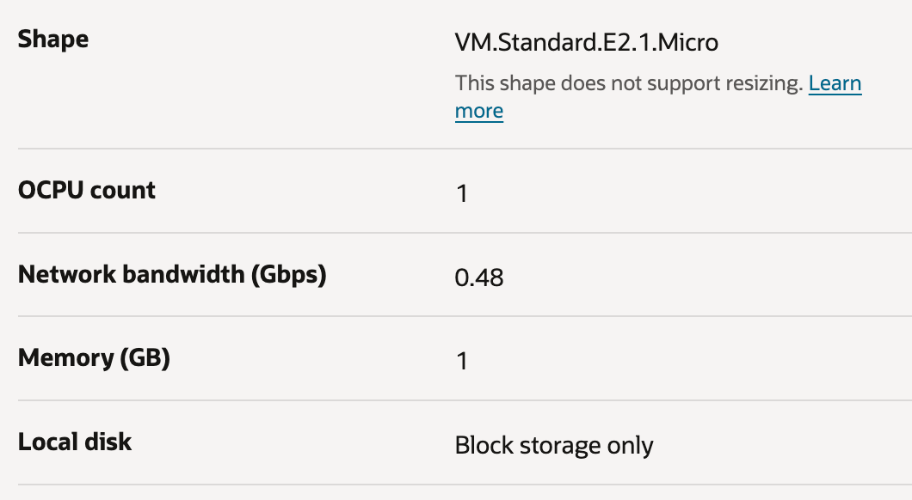

# The Otello showcase

> In addition to a typical web site documentation, this project is provided as blog post, to offer 
> logically sliced chunks of content and alternative entry points. 

## Motivation
This lab is used as:
- A community-driven, self-contained starter package for students and beginners to learn about telemetry.
- A demo kit based on underlying primitives for interactive meetups and conferences.
- A sandbox to work on and test modern Java features in conjunction with telemetry.
- A one-stop-shop to describe easy paths how to set up and use services of Oracle Cloud to unbox the points above. 

## Introduction
The Otello project is an ongoing initiative. It is rooted on three pillars to specifically show:

- How to quickly jump start with provisioning resources und utilizing them on [Oracle Cloud Infrastructure OCI](https://www.oracle.com/cloud/), including
  - How to set up a [Compute Instance](https://www.oracle.com/cloud/compute/) as a sandbox for your workload on OCI.
  - How to set up [Oracle OpenJDK](https://www.oracle.com/java/technologies/downloads/) on a public cloud system utilized by OCI.
  - How to leverage observability on OCI, with [Oracle APM](https://www.oracle.com/manageability/application-performance-monitoring/).
  - How to run modern [Java versions](https://www.oracle.com/java/technologies/downloads/) with its recent language features on OCI.
- A 101 on applied observability introducing concepts based on the [OpenTelemetry](https://opentelemetry.io/) standard: Why and how to perform Java bytecode instrumentation for observability purposes, including
  - How to generate and examine logs from instrumented Java code.
  - How to generate and examine traces from instrumented Java code.
  - How to generate and examine metrics from instrumented Java code.
- Latest features of most recent Java release versions, e.g. 
  - *Pattern Matching for switch*. Originally introduced as preview with JDK 17 and proposed via [JEP 406](https://openjdk.org/jeps/406), this feature was subsequently refined by following JEPs, e.g. [JEP 441](https://openjdk.org/jeps/441) (JDK 21). 
  - *Record Patterns*. Relating to the language feature of pattern matching, this feature extends pattern matching to destructive instances of record classes and adds nested patterns, see [JEP 440](https://openjdk.org/jeps/440) (JDK 21). 

## Installation

### Quick start on Oracle Cloud

For Otello, the Oracle Cloud free tier is sufficient. Register for [Oracle Free Tier](https://signup.oraclecloud.com/). Once registered, log in and proceed to [Compute](https://docs.oracle.com/en-us/iaas/Content/Compute/Tasks/launchinginstance.htm). 
Stick to the defaults. Orchestrate an appropriate setup of your choice, with an *Image and shape* of a base image, e.g. *Canonical Ubuntu 24.04*, to provision a *VM.Standard.E2.1.Micro* with 1 CPU and 1 GB memory. Add an ssh key to the instance. 
Once the instance is created, you can [connect to it](https://docs.oracle.com/en-us/iaas/Content/Compute/Tasks/accessinginstance.htm) with the ssh key you have provided during creation. The target is the public IP address you see in on the detail web page of your instance in the section *Instance access*.  



### Oracle JDK

In the following, for demo purposes and to keep things simple, we perform all steps as *root* user.

Download and install the desired version of [Oracle JDK](https://www.oracle.com/java/technologies/downloads/). Consult the specific documentation at *docs.oracle.com* for detailed guidance. For example, for a *64-Bit Oracle JDK 21 for a Linux system*, look at the detailed documentation to [install Java](https://www.oracle.com/de/java/technologies/downloads/#java21). Example:

```
curl -O https://download.oracle.com/java/21/latest/jdk-21_linux-x64_bin.deb
dpkg -i jdk-21_linux-x64_bin.deb
```

This results in:
```
java --version
java version "21.0.6" 2025-01-21 LTS
Java(TM) SE Runtime Environment (build 21.0.6+8-LTS-188)
Java HotSpot(TM) 64-Bit Server VM (build 21.0.6+8-LTS-188, mixed mode, sharing)
```

Please note that you must use a JDK with a version greater equal 21 to be able to run Otello.

## Set up the baseline

- Install Gradle, e.g. with an appropriate package manager: ```sdk install gradle 8.13```.
- Clone this Git repository on the OCI instance. Your local clone (the directory *otello*) is the working directory for steps below.
- Assemble the build, with Gradle. Navigate into the *app* folder, it's the location of our demo application, and execute: ```gradle assemble```.

## Run&inspect the example

Run the Otello app. Execute: ```java -jar app/build/libs/otello.jar```.

```
2025-03-19T10:27:31.564Z  INFO 2306 --- [           main] otel.MyApplication                       : Starting MyApplication using Java 21.0.6 with PID 2306 (/home/ubuntu/otello/build/libs/otello.jar started by root in /home/ubuntu/otello)
2025-03-19T10:27:31.955Z  INFO 2306 --- [           main] otel.MyApplication                       : No active profile set, falling back to 1 default profile: "default"
2025-03-19T10:27:42.145Z  INFO 2306 --- [           main] o.s.b.w.embedded.tomcat.TomcatWebServer  : Tomcat initialized with port(s): 8080 (http)
2025-03-19T10:27:42.446Z  INFO 2306 --- [           main] o.apache.catalina.core.StandardService   : Starting service [Tomcat]
2025-03-19T10:27:42.447Z  INFO 2306 --- [           main] o.apache.catalina.core.StandardEngine    : Starting Servlet engine: [Apache Tomcat/10.1.8]
2025-03-19T10:27:43.151Z  INFO 2306 --- [           main] o.a.c.c.C.[Tomcat].[localhost].[/]       : Initializing Spring embedded WebApplicationContext
2025-03-19T10:27:43.160Z  INFO 2306 --- [           main] w.s.c.ServletWebServerApplicationContext : Root WebApplicationContext: initialization completed in 10407 ms
2025-03-19T10:27:48.147Z  INFO 2306 --- [           main] o.s.b.w.embedded.tomcat.TomcatWebServer  : Tomcat started on port(s): 8080 (http) with context path ''
2025-03-19T10:27:48.249Z  INFO 2306 --- [           main] otel.MyApplication                       : Started MyApplication in 20.516 seconds (process running for 39.879)
```

The application is started.

Open a second shell, and execute a call to the endpoint:
```
curl localhost:8080/rolldice
```

In the first shell, inspect the console output:
```
2025-03-19T10:28:00.452Z  INFO 2306 --- [nio-8080-exec-1] o.a.c.c.C.[Tomcat].[localhost].[/]       : Initializing Spring DispatcherServlet 'dispatcherServlet'
2025-03-19T10:28:00.453Z  INFO 2306 --- [nio-8080-exec-1] o.s.web.servlet.DispatcherServlet        : Initializing Servlet 'dispatcherServlet'
2025-03-19T10:28:00.457Z  INFO 2306 --- [nio-8080-exec-1] o.s.web.servlet.DispatcherServlet        : Completed initialization in 3 ms
2025-03-19T10:28:01.063Z  INFO 2306 --- [nio-8080-exec-1] otel.RollController                      : Anonymous player is rolling the dice: 1
2025-03-19T10:28:01.141Z  INFO 2306 --- [nio-8080-exec-1] otel.RollController                      : Operate on DiceValue: 1
2025-03-19T10:28:01.142Z  INFO 2306 --- [nio-8080-exec-1] otel.RollController                      : Computation ... 
2025-03-19T10:28:01.158Z  INFO 2306 --- [nio-8080-exec-1] otel.RollController                      : Result of computation: A DiceValue!
2025-03-19T10:28:01.269Z  INFO 2306 --- [nio-8080-exec-1] otel.RollController                      : Ping ...
2025-03-19T10:28:02.861Z  INFO 2306 --- [nio-8080-exec-2] otel.GreetingController                  : ... pong!
```

The output of JDK 17's *Pattern Matching for switch* in conjunction with *Record Patterns* is reported by the output:
```Result of computation: A DiceValue!```, and its coding can be found in [RollController.java](app/RollController.java).

For details on the layout, see e.g. [here](https://opentelemetry.io/docs/languages/java/getting-started/).

This setup is the base for our [zero-code instrumentation](https://opentelemetry.io/docs/zero-code/), as follows next.

## Utilizing OpenTelemetry

Here we discuss OpenTelemetry. To explore concepts of observability, and/or learn about tooling that ships with that standard, this
is the right place to learn more.

[here](otel/README.md)

## Utilizing OCI Observability 

Here we further explore concepts and learn more details on how to leverage OCI for observability.

[here](oci/README.md)

## FAQ

[here](faq/README.md)
