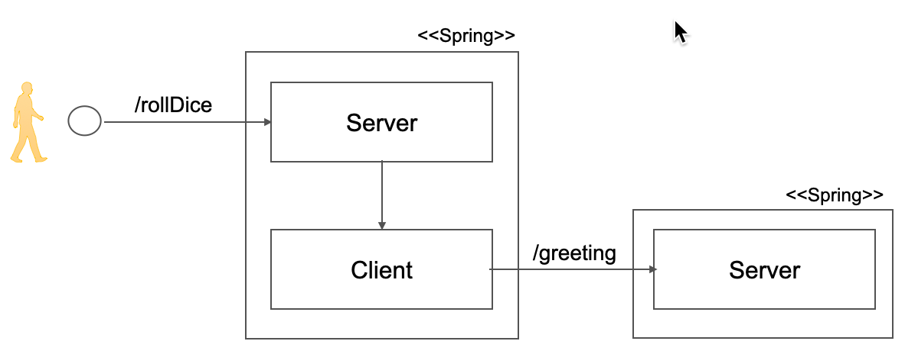

## The Otello application

The example app launches a http server as an entry point for our requests. 
It contains a Java-based [Spring Boot](https://spring.io/projects/spring-boot) application, with a
servlet listening for requests, and processing incoming requests by doing some magic logic on it and calling
another "service" provided by a second server. Those primitives are illustrated in the following representation:

This setup is a customized and updated application loosely based on the snippets provided as part of the [OpenTelemetry documentation](https://opentelemetry.io/docs/languages/java/).
