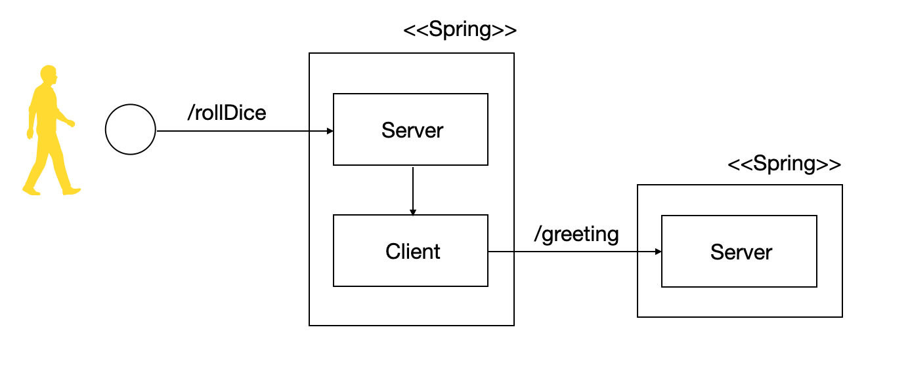

## The Otello App

This entry point covers the design of the Otello App which is running on OCI.

### Application setup

The example app launches a http server as an entry point for our requests. 
It contains a Java-based [Spring Boot](https://spring.io/projects/spring-boot) application, with a
servlet listening for requests, and processing incoming requests by doing some magic logic on it and calling
another "service" provided by a second server. Those primitives are illustrated in the following representation:

The design maps to code as follows. As part of the Spring Boot application 
[MyApplication.java](MyApplication.java), the server-side entry point is [RollController.java](RollController.java).
It in turn operates as client for a call to a server-side [GreetingController.java](GreetingController.java).

This setup is a customized and updated application loosely based on the snippets provided as part of the [OpenTelemetry documentation](https://opentelemetry.io/docs/languages/java/).
