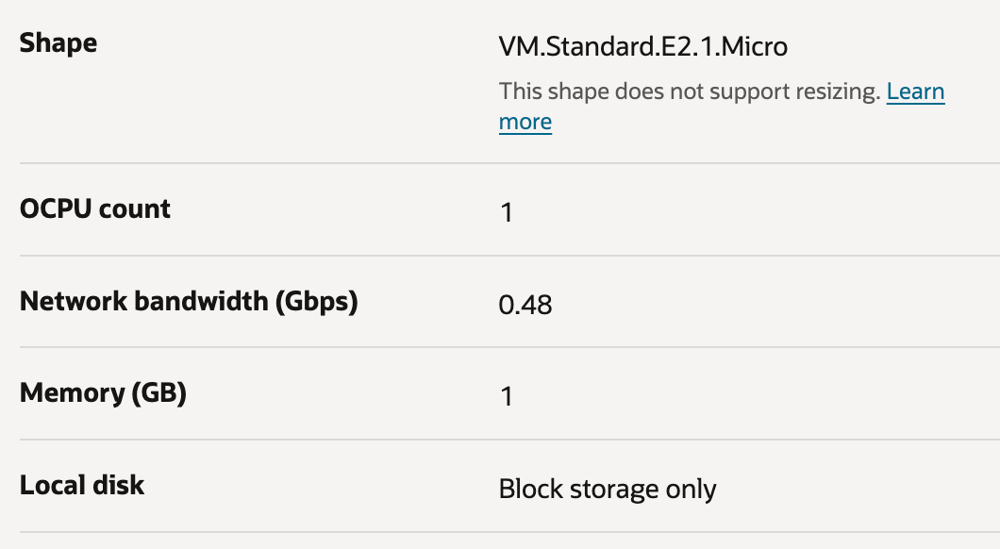

## Installation of Otello

This entry point introduces the installation of *Otello*.

### Quick start on Oracle Cloud

For Otello, the Oracle Cloud free tier is sufficient. Register for [Oracle Free Tier](https://signup.oraclecloud.com/). Once registered, log in and proceed to [Compute](https://docs.oracle.com/en-us/iaas/Content/Compute/Tasks/launchinginstance.htm). 
Stick to the defaults. Orchestrate an appropriate setup of your choice, with an *Image and shape* of a base image, e.g. *Canonical Ubuntu 24.04*, to provision a *VM.Standard.E2.1.Micro* with 1 CPU and 1 GB memory. Add an ssh key to the instance. 
Once the instance is created, you can [connect to it](https://docs.oracle.com/en-us/iaas/Content/Compute/Tasks/accessinginstance.htm) with the ssh key you have provided during creation. The target is the public IP address you see in on the detail web page of your instance in the section *Instance access*.  



### Oracle JDK

In the following, for demo purposes and to keep things simple, we perform all steps as *root* user. Change to root with ```sudo -i```.

Download and install the desired version of [Oracle JDK](https://www.oracle.com/java/technologies/downloads/). Consult the specific documentation at *docs.oracle.com* for detailed guidance. For example, for a *64-Bit Oracle JDK 21 for a Linux system*, look at the detailed documentation to [install Java](https://www.oracle.com/de/java/technologies/downloads/#java21). Example:

```
curl -O https://download.oracle.com/java/21/latest/jdk-21_linux-x64_bin.deb
dpkg -i jdk-21_linux-x64_bin.deb
```

This results in:
```
java --version
java version "21.0.6" 2025-01-21 LTS
Java(TM) SE Runtime Environment (build 21.0.6+8-LTS-188)
Java HotSpot(TM) 64-Bit Server VM (build 21.0.6+8-LTS-188, mixed mode, sharing)
```

Please note that you must use a JDK with a version greater equal 21 to be able to run Otello.

## Set up the baseline

- Install [Git](https://github.com/git-guides/install-git), e.g. with an appropriate package manager: ```apt-get install git-all```.
- Clone this [Git repository](https://git-scm.com) on the OCI instance. Your local clone (the directory *otello*) is the working directory for steps below.
- Install [Gradle](https://gradle.org), e.g. with an appropriate package manager: ```sdk install gradle 8.13```.
- Assemble the build, with Gradle. Navigate into the *app* folder, it's the location of our demo application, and execute: ```gradle assemble```.

