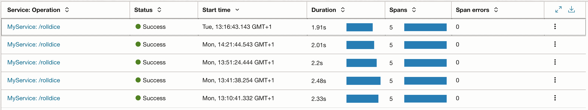
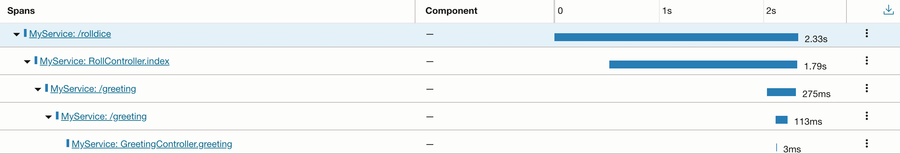
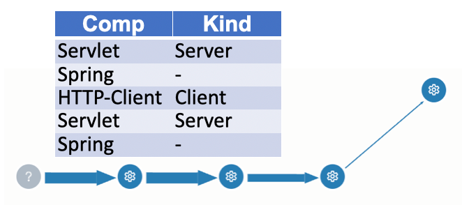

## OCI Observability & Management: APM

In OCI, advanced observability features are located in the Application Performance Management section, *APM* in short.

### Create and configure resources

#### APM domain
First, in OCI under the section *Observability & Management*, navigate to the *APM* section *Administration* and create
an *APM domain*. As necessary steps, choose a name for your domain, and the compartment the APM domain is located in. Check the box that
you want to create the domain as to be free.

#### APM agent
Navigate into the freshly created domain and move to *Install APM agent*. Follow the steps to download, provision and utilize the agent.
When you download the agent from Maven central as documented, please note, the most recent agent version might be newer than the version that is 
mentioned as part of the detailed how-to on that web page inside OCI. Once the agent (jar) is downloaded, provision it with the parameter of data key, service name
and destination. You can generate a data key via UI, a service name of your choice (to later link to it), and reference the endpoint that is listed in the domain overview as destination endpoint to stream data to.
You can double-check the successful provisioning by watching console output and the newly created folder 
named oracle-apm-agent inside your OCI instance's working directory.

### Provision the agent
Provision is done once. This step configures the agent locally to serve later on.

Start the Otello app with : 
```java -javaagent:/home/ubuntu/otello/oracle-apm-agent/bootstrap/ApmAgent.jar -jar -Dspring.jmx.enabled=true -Dserver.tomcat.mbeanregistry.enabled=true /home/ubuntu/otello/build/libs/otello.jar```.

Watch the output:
```
Oracle APM Agent: Starting APM Agent [premain]
Oracle APM Agent: Wrapper: version, hybrid
Java HotSpot(TM) 64-Bit Server VM warning: Sharing is only supported for boot loader classes because bootstrap classpath has been appended
Java HotSpot(TM) 64-Bit Server VM warning: Sharing is only supported for boot loader classes because bootstrap classpath has been appended
Java HotSpot(TM) 64-Bit Server VM warning: Sharing is only supported for boot loader classes because bootstrap classpath has been appended
Java HotSpot(TM) 64-Bit Server VM warning: Sharing is only supported for boot loader classes because bootstrap classpath has been appended
Java HotSpot(TM) 64-Bit Server VM warning: Sharing is only supported for boot loader classes because bootstrap classpath has been appended
Oracle APM Agent: [DirectoryLocation] initialized on classloader [null]
Oracle APM - temp log directory is /tmp/
Oracle APM Agent: Redefining java.base module to allow "opens" access on java.net and java.lang packages to APM agent transformer
Oracle APM Agent: Redefining java.net.http module to allow "opens" access on jdk.internal.net.http packages to APM agent transformer
Oracle APM Agent: Redefining java.base module to allow "opens" access on java.net and java.lang packages to APM agent
Oracle APM Agent: Redefining java.logging module to allow "opens" access on java.util.logging packages to APM agent LOG_LIB probe
Oracle APM Agent: Parsing instrumentation directives
Oracle APM Agent: Loading directives from [built-in.directives]
Oracle APM Agent: Loading directives from [/home/ubuntu/otello/oracle-apm-agent/config/1.17.1.2/DirectivesConfig.acml]
Oracle APM Agent: Parsed a total of [260] directives with Bootstrap Discovery: false
Oracle APM Agent: Initializing AgentInstance
Oracle APM Agent: Initialized AgentInstance
Oracle APM Agent: Started [premain] Agent
Oracle APM Agent: Redefining java.base module to allow "opens" access on java.net and java.lang packages to APM agent
Oracle APM Agent: Redefining java.logging module to allow "opens" access on java.util.logging packages to APM agent LOG_LIB probe
2025-11-10T12:09:45.546Z  INFO 99659 --- [           main] otel.MyApplication                       : Starting MyApplication using Java 21.0.6 with PID 99659 (/home/ubuntu/otello/build/libs/otello.jar started by root in /home/ubuntu/otello/util)
2025-11-10T12:09:45.752Z  INFO 99659 --- [           main] otel.MyApplication                       : No active profile set, falling back to 1 default profile: "default"
2025-11-10T12:09:58.736Z  INFO 99659 --- [           main] o.s.b.w.embedded.tomcat.TomcatWebServer  : Tomcat initialized with port(s): 8080 (http)
2025-11-10T12:10:01.048Z  INFO 99659 --- [           main] o.apache.catalina.core.StandardService   : Starting service [Tomcat]
2025-11-10T12:10:01.048Z  INFO 99659 --- [           main] o.apache.catalina.core.StandardEngine    : Starting Servlet engine: [Apache Tomcat/10.1.8]
2025-11-10T12:10:02.047Z  INFO 99659 --- [           main] o.a.c.c.C.[Tomcat].[localhost].[/]       : Initializing Spring embedded WebApplicationContext
2025-11-10T12:10:02.049Z  INFO 99659 --- [           main] w.s.c.ServletWebServerApplicationContext : Root WebApplicationContext: initialization completed in 15193 ms
2025-11-10T12:10:11.634Z  INFO 99659 --- [           main] o.s.b.w.embedded.tomcat.TomcatWebServer  : Tomcat started on port(s): 8080 (http) with context path ''
2025-11-10T12:10:11.656Z  INFO 99659 --- [           main] otel.MyApplication                       : Started MyApplication in 33.524 seconds (process running for 48.041)
Oracle APM Agent: Running with Bootstrap Discovery: false
                  Total Inspection/Transformation Time: 6871646054 ns (6871.65 ms)
                  Average Inspection/Transformation Time: 1677238.48 ns (1.68 ms)
                  Total Classes Inspected/Transformed: 4097 after 1 iterations of 60 sec each
```

The agent was provisioned.

## Leverage APM

### Trigger some traffic
Open a second shell, and execute a call to the endpoint:

```curl localhost:8080/rolldice```

Watch the first shell. The agent streams the data to the endpoint in OCI.
```
2025-11-10T12:10:41.140Z  INFO 99659 --- [nio-8080-exec-1] o.a.c.c.C.[Tomcat].[localhost].[/]       : Initializing Spring DispatcherServlet 'dispatcherServlet'
2025-11-10T12:10:41.140Z  INFO 99659 --- [nio-8080-exec-1] o.s.web.servlet.DispatcherServlet        : Initializing Servlet 'dispatcherServlet'
2025-11-10T12:10:41.143Z  INFO 99659 --- [nio-8080-exec-1] o.s.web.servlet.DispatcherServlet        : Completed initialization in 1 ms
Oracle APM Agent: Redefining java.base module to allow "opens" access on java.net and java.lang packages to APM agent
Oracle APM Agent: Redefining java.logging module to allow "opens" access on java.util.logging packages to APM agent LOG_LIB probe
2025-11-10T12:10:41.929Z  INFO 99659 --- [nio-8080-exec-1] otel.RollController                      : Anonymous player is rolling the dice: 4
2025-11-10T12:10:41.933Z  INFO 99659 --- [nio-8080-exec-1] otel.RollController                      : Operate on DiceValue: 4
2025-11-10T12:10:41.934Z  INFO 99659 --- [nio-8080-exec-1] otel.RollController                      : Computation ...
2025-11-10T12:10:41.944Z  INFO 99659 --- [nio-8080-exec-1] otel.RollController                      : Result of computation: A DiceValue!
2025-11-10T12:10:42.142Z  INFO 99659 --- [nio-8080-exec-1] otel.RollController                      : Ping ...
2025-11-10T12:10:43.450Z  INFO 99659 --- [nio-8080-exec-2] otel.GreetingController                  : ... pong!
Oracle APM - log directory is /home/ubuntu/otello/oracle-apm-agent/log/instance-20241121-1211_8080
```

### Inspect reports in OCI

Inside OCI console, navigate to the *Trace Explorer*. We see a table with a list of traces, one entry per each call via *curl*. 
In this overview, we see some details including the amount of containing spans.


We can zoom in to show details on the included spans.


We can work on those spans, compare and inspect them.

A graph of our trace with its spans can be displayed, and in our example, it looks like this:



This topology contains the units utilized for the spans.