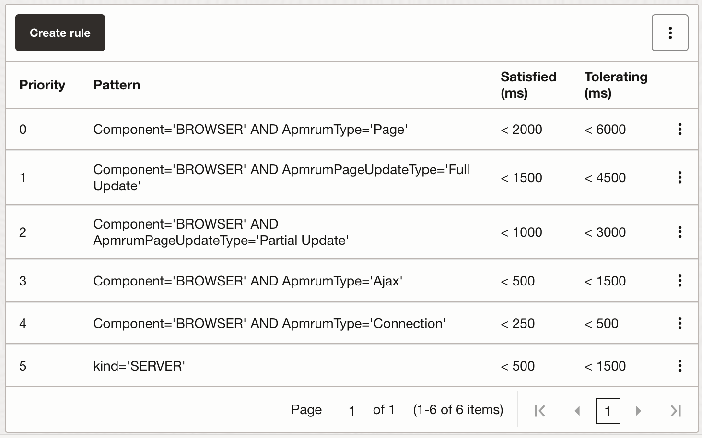

## OCI Observability & Management Metrics: Application Performance Index (Apdex)

OCI integrates with the open standard Apdex to map measures to user satisfaction.
The spec of this standard can be found [here](https://www.apdex.org/wp-content/uploads/2020/09/ApdexTechnicalSpecificationV11_000.pdf) and a description on the [Apdex user group site](https://www.apdex.org).
On OCI, further information on how to integrate are located [here](https://docs.oracle.com/en-us/iaas/application-performance-monitoring/doc/configure-apdex-thresholds.html).

