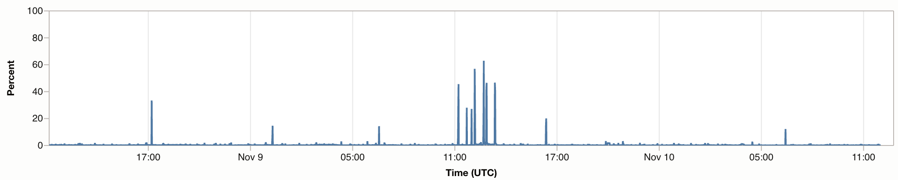

## Observability & Management: Monitoring

Navigating to *Observability & Management*'s section *Monitoring*, a *Metric Explorer* is available. Select
your *compartment* and the *metric namespace* you are interested in (here: *oci_computeagent*). We are keen to inspect the utilization of the
CPU, thus we choose the *metric name* called *CpuUtilization*. Values of the metric are shown in the user-defined
time interval.



The query was configured by selecting entries of predefined fields. The result maps to the query that is shown on the left of the UI:

```CpuUtilization[1m].mean()```