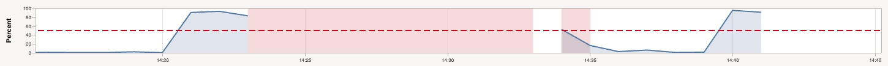

## Troubleshooting

[Gradle's compile task hangs](#compile)  
[Gradle's build throwing instrumenting errors](#instrument)  
[Shell is not my preferred setup](#shell)

<a name="compile"/>

### Gradle's compile task hangs
Description: The Gradle's compile task is hanging.
Possible path: Try to tweak your Gradle build, e.g. add ''--build-cache''. If a free tier solution offers more resources, switch to a VM with more resources.
   You may get further information in the ```Observability & Management``` section in your OCI console. Particularly check the metric ```CpuUtilization``` and ```MemoryUtilization```  in metric namespace ```oci_computeagent```.
   

<a name="instrument"/>

### Gradle's build throwing instrumenting errors
Description: The Gradle build is throwing errors stating that instrumentation is not possible.
Possile path: If you have set properties for instrumentation after the initial build and you again want to run the Gradle build,
then reset the instrumentation by executing ```source util/export-none```. 

<a name="shell"/>

### Shell is not my preferred setup
Description: For editing and running the files, I do not feel comfortable with working directly on the shell. 
Possible path: Try to leverage a smart IDE, e.g. [IntelliJ WebStorm](https://www.jetbrains.com/help/webstorm).
 